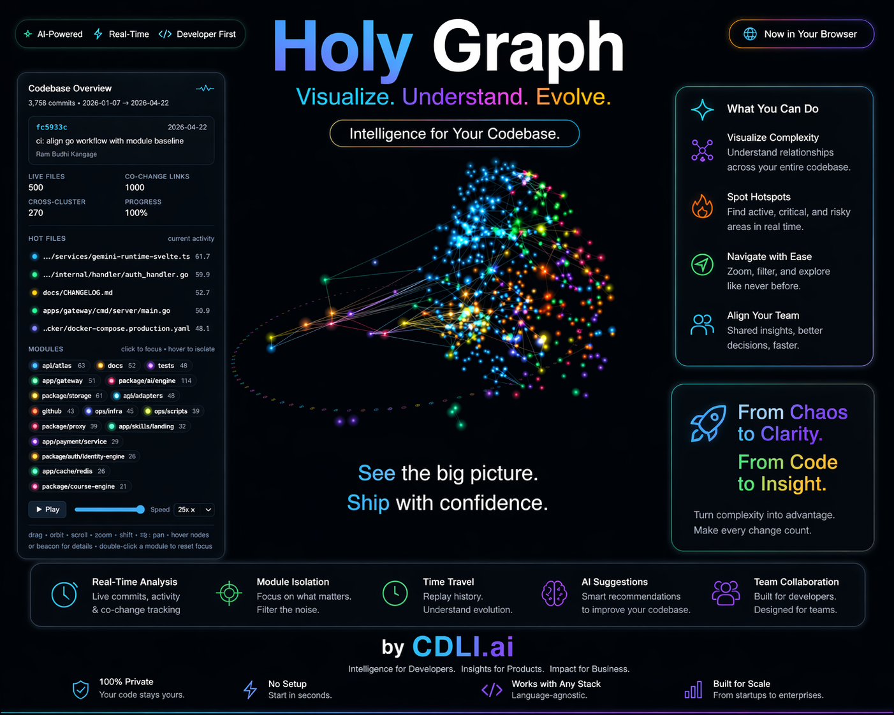

# Holy Graph

> A 3D visualization that replays your codebase's git history — commit by commit.



Holy Graph turns a git repository into a 3D scene: every source file is a glowing point, co-changing files link up, modules cluster, and hot files float above the plane. Not a git-log viewer — a semantic view of how your architecture grew.

## Quick start

```bash
# in any git repository
npx @cdli/holy-graph
```

Opens the visualization in your browser at http://localhost:5173. To export a shareable single-file HTML:

```bash
npx @cdli/holy-graph --out viz.html
```

> **Note:** The `npx` binary ships in v1.0. During Phase 0 development, use `pnpm extract && pnpm dev` from a local clone.

## Gallery

Pre-rendered animations of well-known codebases live at [holygraph.cdli.ai](https://holygraph.cdli.ai).

## What you're seeing

- **Points** — source files. Colour = module (e.g. `apps/atlas`), size = recent activity (decays over time), height = how hot the file is right now.
- **Dim lines** — files in the same module that change together.
- **Bright lines** — cross-module co-change. These are the architectural bridges worth watching.
- **Rings** — bright: file was just born. Soft: file was just touched.
- **Sparks** along edges = signal rippling from a file touched in the current commit toward its strongest co-change neighbours.
- **Beacons** mark each module's home. Hover a point or beacon for details.

## How it works

1. `src/extract/` walks `git log --numstat -M70%`, resolves renames into stable file ids, and emits per-commit deltas plus cluster-cluster affinity to `data.json`.
2. `src/renderer/` replays those deltas with time-based decay on activity and edge weights.
3. A d3-force-3d simulation lays clusters out seeded by affinity; a second sim places files inside each cluster. Three.js draws the scene.

## Configuration

Knobs live in `holy-graph.config.js` (see `src/config/schema.ts` for the full list). Common ones:

| Setting | Effect |
| --- | --- |
| `MAX_FILES_PER_COMMIT` | drop bulk-rewrite commits |
| `MIN_FILE_TOTAL_TOUCHES` | prune rarely-touched files |
| `EXCLUDE` | path regexes to ignore |
| `HALF_LIFE_ACT_DAYS` | how fast a file's glow fades |
| `HALF_LIFE_EDGE_DAYS` | how fast co-change ties fade |

## Controls

Drag to orbit · scroll to zoom · right-drag to pan · play/scrub from the HUD · click a module chip to zoom into it · double-click anywhere to reset.

## License

[FSL-1.1-ALv2](./LICENSE) — source-available, non-competing use permitted, auto-converts to Apache 2.0 on the second anniversary of each release.

## Author

Built by [Fatih Burak Karagöz](https://github.com/CDLI) as part of [CDLI](https://cdli.ai) — *Intelligence for Developers · Insights for Products · Impact for Business.*
