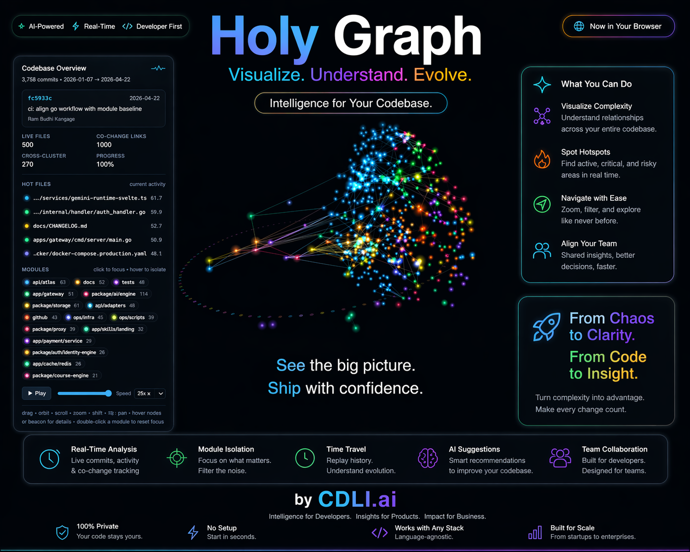

# Holy Graph

> A 3D visualization that replays your codebase's git history — commit by commit.



Holy Graph turns a git repository into a 3D scene: every source file is a glowing point, co-changing files link up, modules cluster, and hot files float above the plane. Not a git-log viewer — a semantic view of how your architecture grew.

## Quick start

```bash
# In any git repository (or subdirectory)
npx @cdli/holy-graph
```

Zero configuration required. Analyzes commit history 100% locally on your machine, auto-discovers repository roots, and launches the 3D visualization in your browser at `http://localhost:7777`.

### Single-file HTML export

Export a self-contained, offline HTML file to share with teammates or embed in architecture reviews:

```bash
npx @cdli/holy-graph --out viz.html
```

## AI-Native: Model Context Protocol (MCP) Server

Holy Graph exposes its semantic co-change graph to AI coding assistants (Cursor, Claude Code, Antigravity) via MCP:

```bash
npx @cdli/holy-graph mcp
```

### Adding to Cursor (`.cursor/mcp.json`)

```json
{
  "mcpServers": {
    "holy-graph": {
      "command": "npx",
      "args": ["-y", "@cdli/holy-graph", "mcp"]
    }
  }
}
```

### Adding to Claude Code

```bash
claude mcp add holy-graph -- npx -y @cdli/holy-graph mcp
```

### Available MCP Tools

- **`holy_graph_get_cochange_neighbors`**: Identifies files that change in tandem with a given file (temporal coupling). Uncovers cross-module architectural bridges.
- **`holy_graph_get_blast_radius`**: Calculates the ripple effect of modified files or current unstaged git changes across architectural modules.
- **`holy_graph_list_hotspots`**: Ranks systemic hotspots with high churn and cross-module entanglement.
- **`holy_graph_get_module_graph`**: High-level module hierarchy and inter-module coupling weights.
- **`holy_graph_explain_architecture`**: Synthesizes an executive markdown architectural breakdown for LLMs.

## Gallery

Interactive 3D replays of well-known open-source codebases live at [holygraph.cdli.ai](https://holygraph.cdli.ai).

## What you're seeing

- **Points** — source files. Colour = module (e.g. `apps/atlas`), size = recent activity (decays over time), height = how hot the file is right now.
- **Dim lines** — files in the same module that change together.
- **Bright lines** — cross-module co-change. These are the architectural bridges worth watching.
- **Rings** — bright: file was just born. Soft: file was just touched.
- **Sparks** along edges = signal rippling from a file touched in the current commit toward its strongest co-change neighbours.
- **Beacons** mark each module's home. Hover a point or beacon for details.

## How it works

1. `src/extract/` walks `git log --numstat -M70%`, resolves renames into stable file ids, and emits per-commit deltas plus cluster-cluster affinity to `data.json`.
2. `src/renderer/` replays those deltas with time-based decay on activity and edge weights.
3. A d3-force-3d simulation lays clusters out seeded by affinity; a second sim places files inside each cluster. Three.js draws the scene.

## Configuration

Drop a `holy-graph.config.js` (or `.mjs` / `.ts`) next to your repo:

```js
// holy-graph.config.mjs
export default {
  port: 3000,
  extract: {
    maxFilesPerCommit: 40,
    minFileTotalTouches: 3,
    // exclude: [/\/fixtures\//, /\.generated\.ts$/],
  },
};
```

All keys are optional. CLI flags (`--port`, `--since`, `--config`) override config values.

### Available knobs

| Setting | Effect |
| --- | --- |
| `port` | Dev server port (default: 7777, falls back if busy) |
| `extract.maxFilesPerCommit` | drop bulk-rewrite commits (default: 80) |
| `extract.minFileTotalTouches` | prune rarely-touched files (default: 2) |
| `extract.exclude` | path regexes to ignore (adds to defaults) |

## Controls

Drag to orbit · scroll to zoom · right-drag to pan · play/scrub from the HUD · click a module chip to zoom into it · double-click anywhere to reset.

## License

[FSL-1.1-ALv2](./LICENSE) — source-available, non-competing use permitted, auto-converts to Apache 2.0 on the second anniversary of each release.

## Author

Built by Fatih Burak Karagöz as part of [CDLI](https://cdli.ai) — *Intelligence for Developers · Insights for Products · Impact for Business.* Source on [github.com/cdliai/holy-graph](https://github.com/cdliai/holy-graph).
